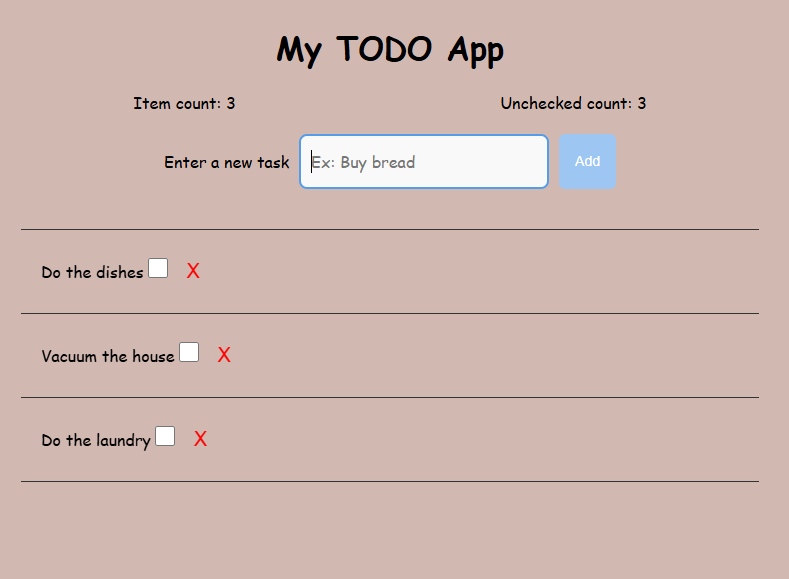

# TodoApp
A Simple and Intuitive Task Manager

Welcome to your web-based Todo application — a clean, responsive, and user-friendly way to stay organized and manage your tasks with ease.

Built as part of the CS50 Introduction to Mobile App Development, this project reflects my ongoing journey in web development.

🚀 Features :
📝 Create new tasks

✏️ Edit existing tasks

✅ Mark tasks as complete

❌ Delete tasks

